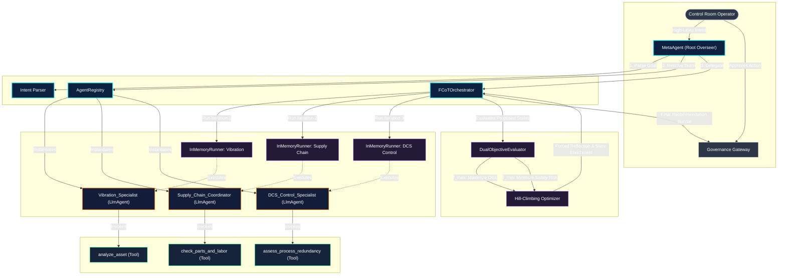

# 🛡️ ARES: Level 5 Managed Multi-Agent System for Asset Health Decision Making


-10b981?style=for-the-badge)


**ARES (Asset Recovery & Agentic Ecosystem Sentinel)** is an enterprise-grade, Level 5 Managed Multi-Agent System engineered to automate high-stakes operational and safety decisions in agentic-first industrial plants (e.g., thermal power generators, chemical processing plants, and heavy manufacturing).

Built strictly on the **Google Cloud Agentic Stack** using the **Agent Development Kit (ADK)** and Gemini 2.5 Flash, ARES implements **GEAP Blueprint 4 (The Governed Ecosystem)**. The system dynamically parses operator intents, recomposes specialized sub-agent teams, executes a multi-level **Hierarchical Fractal Chain of Thought (FCoT)** loop, performs a **Dual-Objective Hill-Climbing** optimization, and enforces **Human-on-the-Loop Governance** before dispatching physical SCADA commands.

---

## 🧠 System Architecture & Cognitive Mesh

ARES enforces a highly disciplined, non-lateral **Hub-and-Spoke** topology. Specialized worker agents operate within isolated `InMemoryRunner` containers without lateral cross-talk, returning control naturally back to the central `MetaAgent` supervisor for multi-scale synthesis.



### The Cognitive Mesh & Mapped Personas
1. **Meta-Agent (Root Overseer - [meta_agent.py](file:///Users/arsanjani/AntigravityRepo/Asset%20Health%20Decision%20Making/meta_agent.py))**: The parent supervisor responsible for intent parsing, capability-based dynamic team recomposition, and compilation of final operational recommendations.
2. **Vibration Specialist Agent (`Vibration_Specialist` - [agent_registry.py](file:///Users/arsanjani/AntigravityRepo/Asset%20Health%20Decision%20Making/agent_registry.py#L121))**: A Google ADK `LlmAgent` configured with the `analyze_asset` tool. It analyzes high-frequency FFT signatures and bearing temperatures to diagnose mechanical faults.
3. **Supply Chain Coordinator Agent (`Supply_Chain_Coordinator` - [agent_registry.py](file:///Users/arsanjani/AntigravityRepo/Asset%20Health%20Decision%20Making/agent_registry.py#L145))**: A Google ADK `LlmAgent` configured with the `check_parts_and_labor` tool. It queries ERP/Maximo databases for parts inventory, expedited shipping times, and crew schedules.
4. **DCS Control Specialist Agent (`DCS_Control_Specialist` - [agent_registry.py](file:///Users/arsanjani/AntigravityRepo/Asset%20Health%20Decision%20Making/agent_registry.py#L169))**: A Google ADK `LlmAgent` configured with the `assess_process_redundancy` tool. It monitors plant SCADA systems to verify standby redundancy and manage plant Megawatt (MW) load distributions.

---

## 🔄 Hierarchical Fractal Chain of Thought (FCoT)

Unlike standard linear reasoning chains, ARES's **Fractal Chain of Thought (FCoT)** loop recursively applies competing objective functions ($f_{max}$ and $f_{min}$) across three scales of abstraction, self-correcting at each boundary:

```text
       Macro Scale  [Plant Megawatts, Global Redundancy, Plant OEE]
            ▲
            │ (3. Global Optimum)
       Meso Scale   [ERP Parts Inventory, Shipping Lead Times, Labor Scheduling]
            ▲
            │ (2. Logistical Compromise)
       Micro Scale  [Bearing Vibration, Local Temperature, Equipment Physics]
            │
            ▼ (1. Local Safety Optimum)
```

1. **Iteration 1: Micro-Level Focus (Local Mechanical Safety)**
   * **Thought**: Focuses strictly on the local physics and mechanical health of the asset.
   * **Action**: Invokes the `Vibration_Specialist` to analyze sensor data.
   * **Observation**: Severely high vibration ($12.8\text{ mm/s}$) and bearing temperature ($87.5^\circ\text{C}$).
   * **Formulated State**: *Immediate Emergency Shutdown*. This is the perfect local safety optimum (Risk = 0.00), but a global operational failure as it cuts plant output by 50%.
   * **Forced Reflection**: *"What did we miss regarding OEE and Risk?"* The Meta-Agent realizes that a 50% capacity drop is unacceptable, forcing the loop to scale up to the Meso level.

2. **Iteration 2: Meso-Level Focus (Operational & Logistical Compromise)**
   * **Thought**: Incorporates logistics to resolve the capacity gap.
   * **Action**: Invokes the `Supply Chain Coordinator` to query ERP databases.
   * **Observation**: Bearings have a 24-hour lead time; the crew is available in 36 hours.
   * **Formulated State**: *Throttle to 60% load for 36 hours*. This balances plant output (OEE climbs to 0.39), but running a damaged bearing for 36 hours carries an elevated cumulative risk of catastrophic failure (Risk = 0.65).
   * **Forced Reflection**: *"What did we miss regarding OEE and Risk?"* The Meta-Agent identifies the high residual risk, forcing the loop to scale up to the Macro level.

3. **Iteration 3: Macro-Level Focus (Global Plant Optimum)**
   * **Thought**: Resolves the residual safety risk using plant-wide control systems.
   * **Action**: Invokes the `DCS_Control_Specialist` to check standby redundancy.
   * **Observation**: Standby `Pump 2B` is healthy ($98.5\%$) and a 30-minute hot-swap is capable.
   * **Formulated State**: *Initiate Hot-Swap to Pump 2B; Shutdown Pump 2A*.
   * **OEE vs. Risk Balance**: Achieves a perfect global optimum. OEE is fully sustained at 1.00 ($100\%$ capacity), and safety risk is virtually eliminated (Risk = 0.00) since the damaged pump is idle and isolated.

---

## 📈 Dual-Objective Mathematical Hill-Climbing

Each formulated state $S$ is mathematically evaluated by the [DualObjectiveEvaluator](file:///Users/arsanjani/AntigravityRepo/Asset%20Health%20Decision%20Making/evaluator.py#L20):

### 1. Overall Equipment Effectiveness (OEE) Score [$f_{max}(S)$]
$$f_{max}(S) = A(S) \times P(S) \times Q(S)$$
*   **Availability $A(S)$**: Scales with the primary asset's operating capacity, but remains a perfect $1.0$ if standby redundancy is active:
    $$A(S) = \begin{cases} 1.0 & \text{if } \text{redundancy\_active} \\ \frac{\text{operating\_load\_pct}}{100.0} & \text{otherwise} \end{cases}$$
*   **Performance $P(S)$**: Plant output relative to nominal capacity ($500\text{ MW}$):
    $$P(S) = \frac{\text{production\_mw}}{500.0}$$
*   **Quality $Q(S)$**: Process stability index penalized by high vibrations and bear temperatures:
    $$Q(S) = 1.0 - 0.4 \times \frac{\max(0, \text{vibration\_rms} - 2.0)}{15.0} - 0.2 \times \frac{\max(0, \text{bearing\_temp} - 50.0)}{50.0}$$

### 2. Safety Risk / Penalty Score [$f_{min}(S)$]
$$f_{min}(S) = \text{Risk}_{\text{primary}}(S) \times (1.0 - 0.95 \times \text{redundancy\_active})$$
Where:
$$\text{Risk}_{\text{primary}}(S) = \max(R_{\text{vib}}, R_{\text{temp}}) \times (0.3 + 0.7 \times R_{\text{time}})$$
*   **Vibration Risk**: $R_{\text{vib}} = 1.0 - e^{-0.23 \times \text{vibration\_rms}}$
*   **Temperature Risk**: $R_{\text{temp}} = 1.0 - e^{-0.06 \times (\text{bearing\_temp} - 50)}$
*   **Time Risk**: $R_{\text{time}} = 1.0 - e^{-0.04 \times \text{maintenance\_delay\_hours}}$

---

## 🎨 Premium Glassmorphic Operator Interface

The dashboard (**ARES - Sentinel**) is built as a highly responsive Single Page Application (SPA) using HTML5, Vanilla CSS, and modern JavaScript, served directly from a FastAPI backend:

*   **Live FCoT Stream**: Card-based execution feed that animates the Thought, Action, Observation, and Reflection blocks sequentially as they stream from the LLM.
*   **Tailored Color Palette**: Slate charcoal background with glowing neon blue (primary), safety orange (warnings), and neon green (optimum/healthy) accents.
*   **Dynamic SVG Trajectory Plot**: Automatically draws a vector path mapping the OEE ($f_{max}$) vs. Safety Risk ($f_{min}$) values across the three FCoT iterations, visualizing the hill-climbing progress.
*   **Human-on-the-Loop Gateway**: A glowing bottom bar displaying the final optimized recommendation and locking physical SCADA dispatches until the operator clicks **Approve & Deploy**.

### ARES Operator Dashboard UI Mockup


---

## 🚀 Getting Started Runbook

### Prerequisites
Ensure your local environment has authenticated application default credentials:
```bash
gcloud auth application-default login
```

### 1. Virtual Environment Setup
Initialize your Python virtual environment and install the required dependencies (including Google ADK, FastAPI, and Uvicorn):
```bash
# 1. Create virtual environment
python3 -m venv .venv

# 2. Activate virtual environment
source .venv/bin/activate

# 3. Install core Vertex AI SDK with ADK and Agent Engines
pip install "google-cloud-aiplatform[adk,agent_engines] @ git+https://github.com/googleapis/python-aiplatform.git@copybara_821692627" --extra-index-url https://pypi.org/simple
```

### 2. Run the CLI Simulator
To run a standalone simulation and trace the hierarchical FCoT console logs, run:
```bash
python3 main.py
```

### 3. Start the Web Dashboard
To launch the interactive FastAPI web dashboard, run:
```bash
python3 main_web.py
```
Open your browser and navigate to: **[http://localhost:8000](http://localhost:8000)**.
